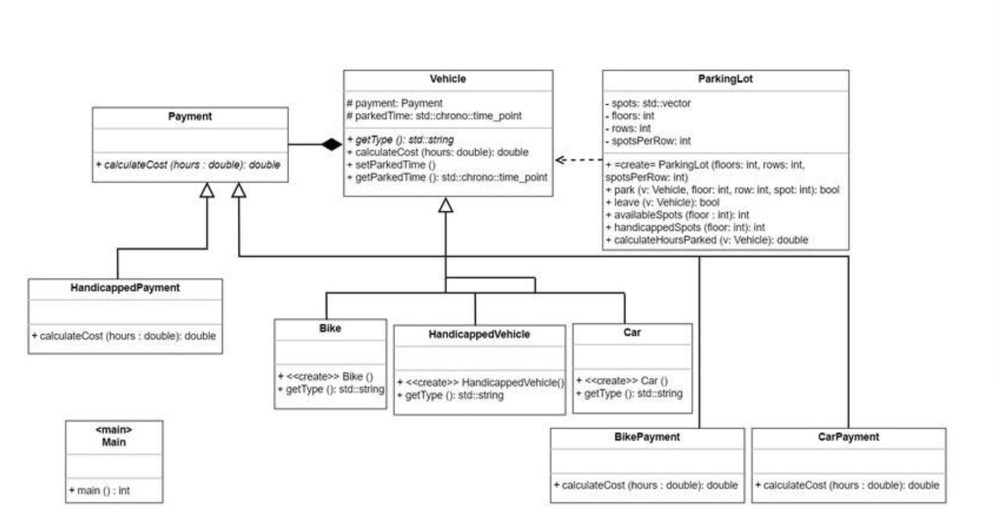
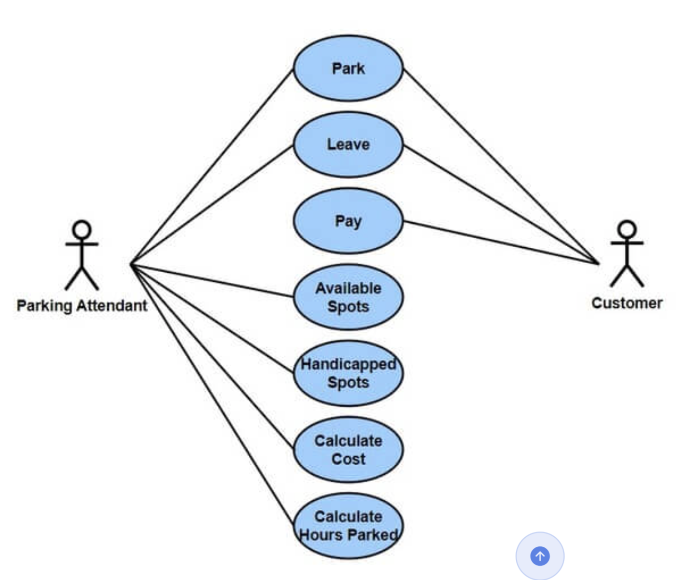

Functional Requirement

1. The System should be able to park car, bike and other categories of vechicle
2. System should be able to track the amount of time a vechicle has been parked
3. Sytem should be able to find the parking spot for car, bike and handicapped vechicle
4. System should be able to calculate the cost of parking for each type of vechicle
5. System should be able to remove a vechicle from a parking spot

Non Functional Requirement

1. System should be able to handle many vechicle and parking spot
2. Should be extensible for further updates and new features
3. Highly available
4. Security and authorised access

Class Diagram

In our system we can clearly define some main classes as follows

1. Vehicle (parent)
   child:
   a) Bike
   b) Car
   c) Handicapped Vechicle
2. Payment (Parent)
   child:
   a) CarPayment
   b) BikePayment
   c) Handicapped Payment
3. Parking Lot

Use Case Diagram

